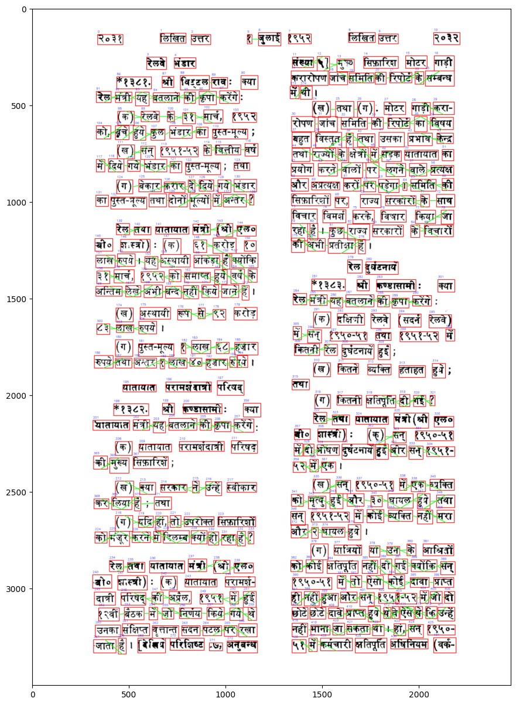
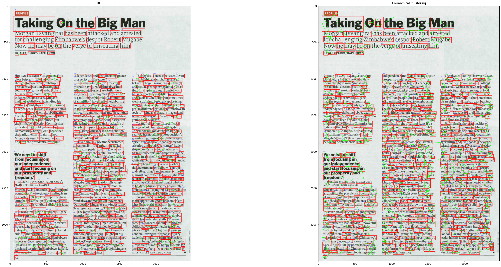
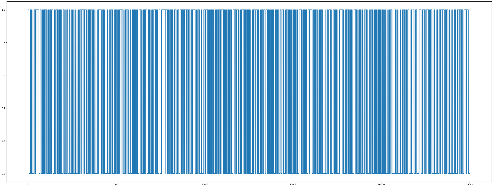

# Assignment -5

### Chekkapalli Naveen
### 2021101025

## Question 1 - Kernel Density Estimation
### Task 1
* Wrote a class of KDE with kernels - 'gaussian', 'box' and 'triangle'.
* Wrote methods 'fit' and 'density' which gives the density of the sample
* Calculates bandwidth using pseudo-likelihood method if not specified
* Visualizes only 1-d and 2-d data

### Task 2
* From the data calculated the horizontal and vertical distances between each box by calculating the distances between edge centers under appropriate conditions

* Applied KDE on this data for both the arrays and set the threshold where the density is maximum for each image

* Did not do 4.2 at that time but was able to do it now using clustering. Applied clustering on these distances and calculated the nearest distance in the cluster and set thresholds according to that

* The results are as follows for kernel - "Gaussian" and pseudo likelihood bandwidth


* Comparision between clustering and KDE
 

## Question 2 - Hidden Markov Models
### Task 3 Part 1
* The following results were obtained for the rolls data
```
Best model score:  -43062.806197196056
Sequence of switching between the fair and loaded die.:  [1 1 1 ... 0 0 0]

```
* The generated states for validation data


* This Task corresponds to the **DECODING** question in HMM. Because since we are asked to find the most likely sequence of switching between the fair and loaded die i.e decoding the parts produced by the fair die and the loaded die

### Task 3 Part 2
* The resuts for this task is
```
The probability that the fair die is switched out for the loaded one:  0.1816597962006963
The probability that the loaded die is switched out for the fair one:  0.18523877740346306
Transition matrix: 
[[0.8183402  0.1816598 ]
 [0.18523878 0.81476122]]
```
* This task corresponds to the **LEARNING** question in HMM. Because we were asked to find how often the casino is switching out the fair die for the loaded one and vice versa

### Task 3 Part 3
* The results for this task is
```
The loaded dice probabilities from 1 to 6 respectively is:  [0.17187089 0.16314268 0.17606963 0.16810604 0.17113334 0.14967742]
Loaded die is biased towards:  3
```
* This task corresponds to the **LEARNING** question in HMM. Because we were asked to find the probabilities of the loaded die and How "loaded" is it.

### Task 4
* The results for this task is
```
Starting state:  [1.00000000e+00 2.20378863e-23]
Transition matrix: 
[[0.53142922 0.46857078]
 [0.44992293 0.55007707]]
Emission probabilities: 
[[0.02041353 0.21967363 0.25073026 0.1970241  0.15499909 0.
  0.15715939]
 [0.02273068 0.1988781  0.2304982  0.0133712  0.28631554 0.
  0.24820629]]

```
* Choosing the best model, and the information from it
**VIRAT** plays the **FIRST** ball and **ROHIT** plays the **LAST** ball